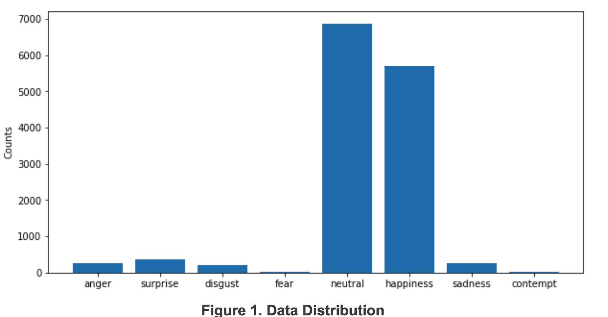
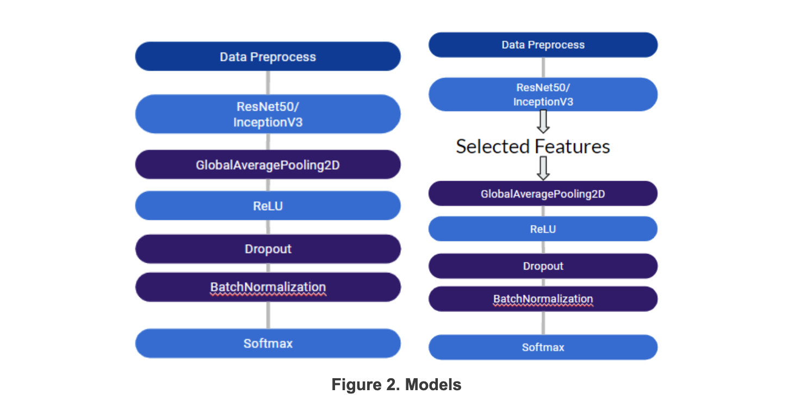
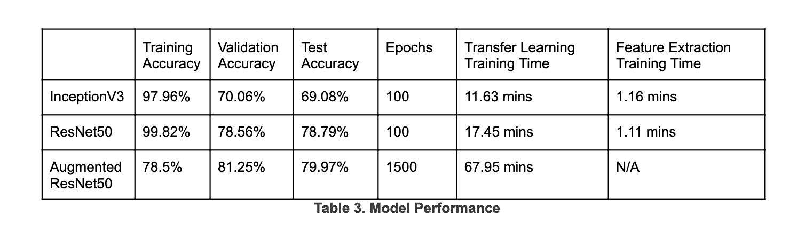
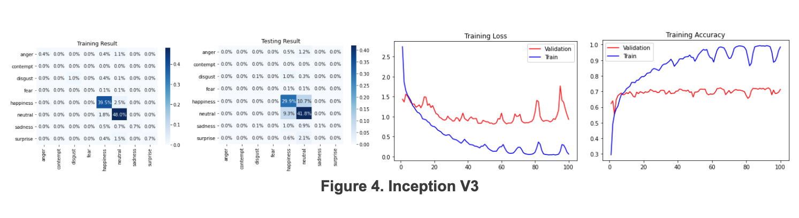
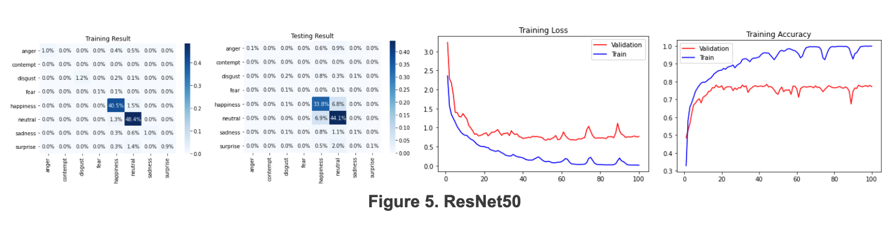
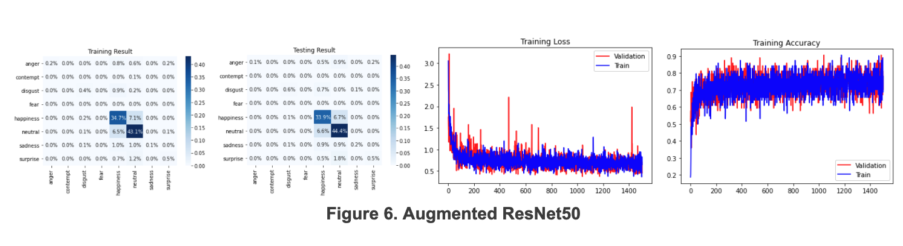
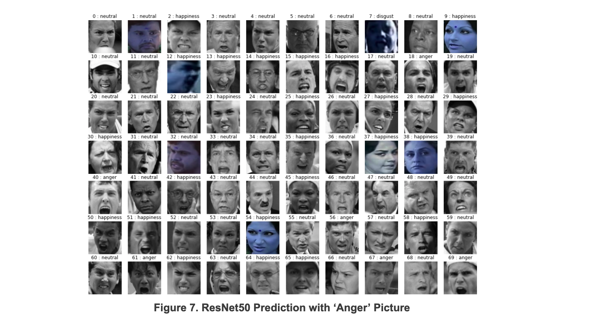

##### UW-Madison: CS539 Fall 2020
# Facial Expression Classification with Images
#### By Rohan Mendiratta, Huanran Li 
#### <a href="http://github.com/romendiratta/Face-Emotion-ANN">View Repository</a>

 

### **I. Introduction**
In the recent decade, convolutional neural networks have shown a tremendous advantage in picture classification tasks. The idea of a building convolutional neural network to extract key points in the face and determine emotion based on this has previously been proposed (Mehendale). The idea of using a pre-existing neural network and using transfer learning to classify human emotion has also been proposed as well (Gilligan). Both of these ideas and accompanying research have shown that this task can be accomplished in different ways with high accuracy. The problem with this though is that this source code is not publicly available for use. In this project, the aforementioned research will be used as inspiration to build a convolution neural network to solve this problem with a high degree of accuracy. 

With the advance of technology in today’s age, face-to-face contact is less common. For humans, it has always been easy to detect emotions, but the same cannot be said for machines. This is why the idea of building an algorithm to identify human emotion based on the image of someone’s face has been proposed. The utilization of this algorithm can be significant in many ways. With this algorithm, the world can take advantage to improve the human quality of life. This applies to many facets of life. Automated emotion recognition is significant in a few fields: Robotics - To design smart and collaborative service robots that can interact with humans appropriately; Marketing - To create specialized advertising based on the emotional state of a person; Education - To improve learning processes and knowledge transfer; Entertainment - To recommend appropriate entertainment for a target audience based on emotional state.

The idea of automated emotion recognition is not new. In a related work, attempting to identify human emotion through electrocardiography, galvanic skin response, heart rate variability, etc. has been proposed and successful to a high degree (Dzedzickis). In a similar work, emotion recognition has been attempted through the processing of text (Ezhilarasi). Within both of these works, the classification of emotion has been done through active data collection. On the other hand, imaging of face can be done passively, which makes the proposed algorithm very powerful as no interaction is required in order to detect emotion.
 

### **II. Methods**

#### **Data**
The data used is from New York University created by Professor Rowe with his machine learning graduate students [?]. It consists of 13,690 cropped human faces with 8-class labels. The images are 3 channels and sized 256 by 256 pixels. Each face was labeled with anger, contempt, disgust, fear, happiness, neutral, sadness, or surprise.

 

For the preprocessing of the data, the images are resized to 128 by 128 pixels to reduce convergence time, while still maintaining a high degree of accuracy. Transformation techniques such as inverting and rotating will be used on the dataset while preprocessing to overcome the data imbalance (as shown in Figure 1) and avoid model overfitting. The data is split into 56% training, 14% validation, and 30% testing sets using the scikit-learn library. 

#### **Algorithm**
The convolutional neural net has been constructed using transfer learning. ResNet50 and InceptionV3 were both used separately as base models and their performances are individually determined. Both models have been initialized with ImageNet weights and additional layers have been added. The base layers are not trained, while the additional layers are trained specifically for emotion classification. Both models were compiled using the categorical cross entropy loss function, as this function is optimized for multi-category classification. The detailed structure is shown at Figure 2 (left).

To speed up the training process, we developed the second model as shown in Figure 2 (right) which feeds the data though the pre-trained network once and uses the extracted feature as input to train the last few layers. Because of its nature, this network cannot take any augmented data because the feature was extracted only once before training.

 

These models have been built on the Python platform while utilizing the TensorFlow and Keras libraries to build the models. Image pre-processing functions and model constructing is done using Keras functions. The following categories are used to evaluate model performance: Training Accuracy; Validation Accuracy; Test Accuracy; Training Time. Training accuracy and validation accuracy will be indicators of whether the model has completed training. Test accuracy is the main indicator of how the model will perform on unseen images and is the main factor in determining which model is better suited for this classification task. Training time is a small factor here. As long as training time is not unfeasible, it can be disregarded as the model only needs to be trained once. Training time is relative to the Google Colab platform, which both models are trained on. GPU processing is enabled and the NVIDIA TESLA K80 that is offered on Google Colab is used while training both models to improve convergence time. 
 

### **III. Results**
The results after training both networks are shown at Table 3. All networks were trained with 2 steps per epoch, 32 batch size, rmsprop optimizer. Without augmented data, both models reached nearly 100% training accuracy. However, for the validation and testing, InceptionV3 reached around 70% and ResNet 50 performs better with 78.79% accuracy on the testing data. Training time for 100 epochs is slightly longer for ResNet50, but this difference can be disregarded as the training time is still feasible. Instead of training the entire network, if the features were extracted beforehand and acted as the input for the last few layers, we got the level of performance with approximately 10 times faster speed.

With data augmentation including rotation, shift, zoom, and flip, the model had a smaller gap between training and validation accuracy, which supposed that overfitting was not as effective as before. Within our expectation, the testing accuracy was improved by around 1 percent.

 

Figure 4 shows the result from training the InceptionV3 transfer model. A large portion of outlier labels were identified as either happiness or neutral. For the major labels, the precision is 70.5% for happiness and 73.2% for neutral. The recall is 73.6% for happiness and 81.8%. There was turbulence in both loss and accuracy. It may be due to the small training epoch and overfitting.

 

Figure 5 shows the result from training the ResNet50 transfer model. Outliner labels’ performance is similar to InceptionV3. For the major labels, the precision is 77.9% for happiness and 79.7% for neutral. The recall is 83.0% for happiness and 86.5%. All of those metrics were improved by more than 5% compared to the results of Inception V3. There was still turbulence but with a smaller magnitude in both loss and accuracy. 

 

Figure 6 shows the result from training the ResNet50 transfer model with augmented data. The training accuracy was worse than non-augmented networks. However, we had a 0.1% gain on the accuracy of happiness during the test.

 

### **IV. Discussion and Conclusion**
From the training results, it is concluded that both models were experiencing an overfitting issue during the training without data augmentation. From Figure 4 and Figure 5, we observed that the validation accuracy was not significantly improved after the first 20 training epochs. However, with data augmentation, the gap between training and testing accuracy was eliminated, which proved that data augmentation was effective in reducing the overfit of pictures in this case.

Apparently, non-uniform data distribution was a major challenge for training with this dataset. In fact, several different methods were tested beyond this report, including bootstrapping the outlier categories and reducing dominant categories to produce a uniform-distributed data. However, none of these experiments were generating satisfied results. The first reason is that the difference in sample size was too significant to bootstrap and have enough meaningful information to make the network robust. By augmenting the data, the model was still overfitting to specific people’s faces during the training.

The second reason is the mis-labeled data. Figure 7 displays the result predicted from ResNet50. The text above each picture was the prediction from ResNet50. All pictures were labeled as “Anger”. Those pictures were in the test dataset, which was not fed to networks during the training. Among those 70 pictures, around half of their labels were in controversy. Pictures including 1,9,35,65 cannot be recognized as “Anger”. So, by bootstrapping the outlier categories, mis-labeled data was going to be fed more times to the network, which can be misleading for the network to learn.

 

### **V. References**

Mehendale, N. 
<cite>Facial emotion recognition using convolutional neural networks (FERC). SN Appl. Sci. 2, 446 (2020). https://doi.org/10.1007/s42452-020-2234-1</cite>

Gilligan, T. 
<cite>(2016). Emotion AI , Real-Time Emotion Detection using CNN.</cite>

Dzedzickis, Andrius et al. 
<cite>“Human Emotion Recognition: Review of Sensors and Methods.” Sensors (Basel, Switzerland) vol. 20,3 592. 21 Jan. 2020, doi:10.3390/s20030592</cite>

Ezhilarasi, R., & Minu, R. I. 
<cite>(2012). Automatic emotion recognition and classification. Procedia Engineering, 38, 21–26. https://doi.org/10.1016/j.proeng.2012.06.004</cite>
